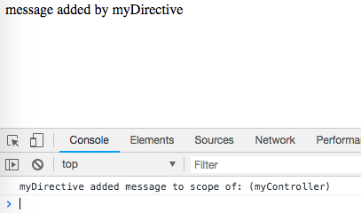

AngularJS1 Directive Scope True Demo
====================================

`scope`
-------

- `true`: A new child scope that prototypically inherits from its parent will be created for the directive's element. If multiple directives on the same element request a new scope, only one new scope is created.

```
npm install
open index.html
```



Resources
---------

- AngularJS1: <https://angularjs.org/>
- directive scope api: <https://docs.angularjs.org/api/ng/service/$compile#-scope->
- $element api: <https://docs.angularjs.org/api/ng/function/angular.element#angularjs-s-jqlite>