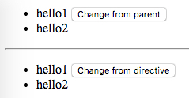

AngularJS1 Directive Scope False Demo
=====================================

`scope`: `false` (default): No scope will be created for the directive. The directive will use its parent's scope.

```
npm install
open index.html
```



Resources
---------

- AngularJS1: <https://angularjs.org/>
- directive scope api: <https://docs.angularjs.org/api/ng/service/$compile#-scope->
- $element api: <https://docs.angularjs.org/api/ng/function/angular.element#angularjs-s-jqlite>